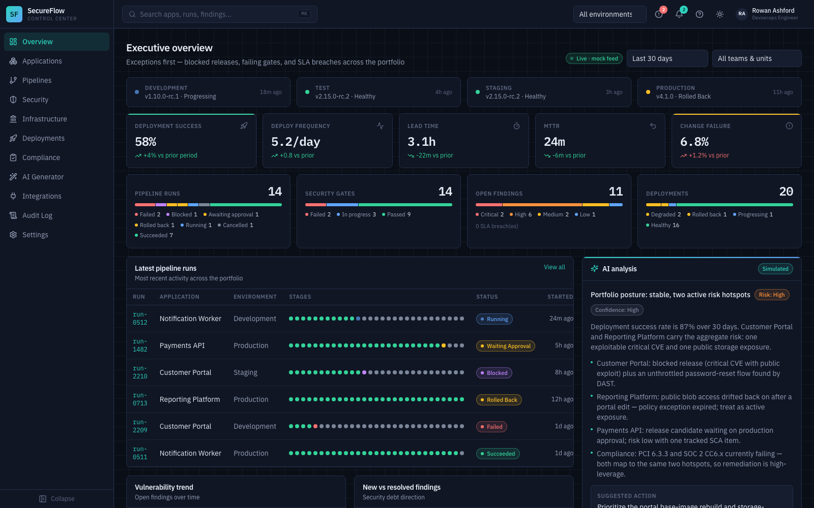
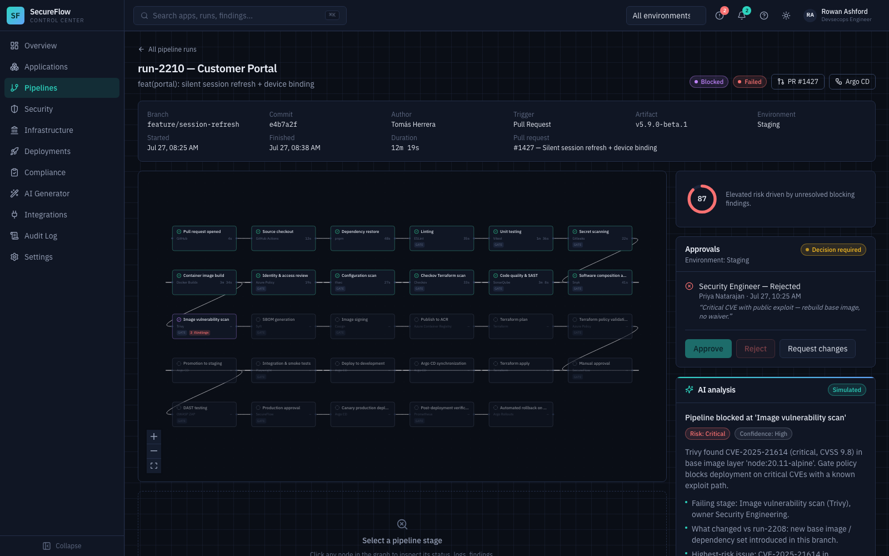
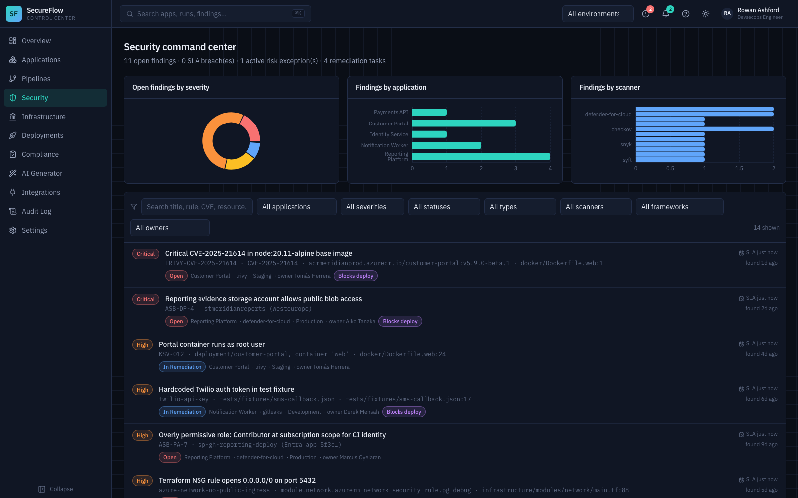
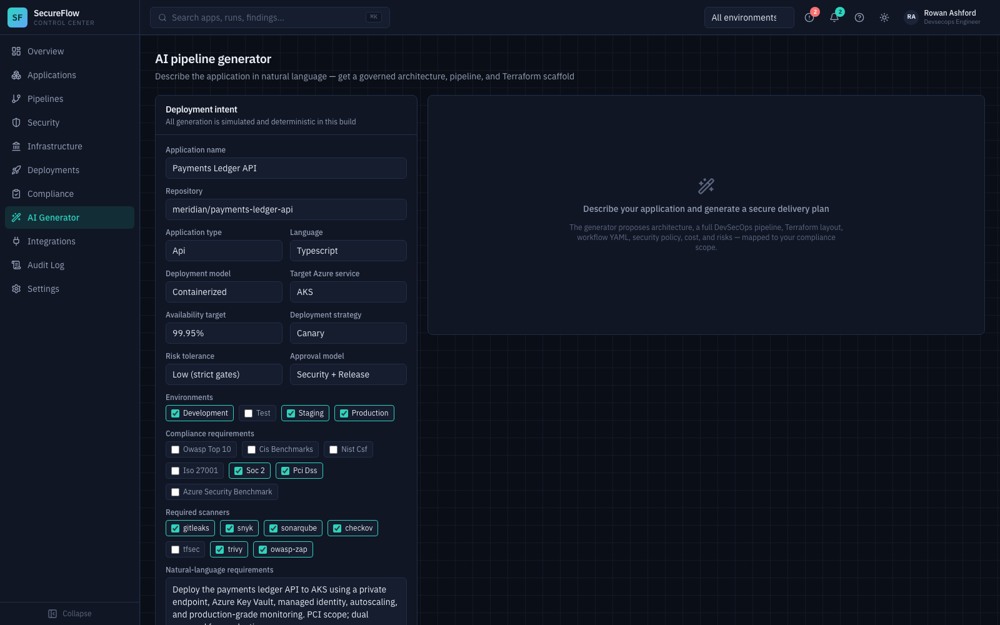

# SecureFlow Control Center

An AI-native DevSecOps pipeline governance and orchestration platform. Platform, security, development, and compliance teams get one place to express deployment intent, review generated architectures and pipelines, validate security and compliance gates, approve releases, and promote them through environments.

> **Honesty note:** this first version runs entirely on **deterministic mock providers and a simulated AI service**. Every integration (GitHub, Argo CD, scanners, Azure, the AI) sits behind a clean adapter interface so real endpoints can be plugged in without touching UI code. Nothing in the UI claims to be live when it is not — simulated surfaces are labeled.

## Quick start

```bash
pnpm install
pnpm dev          # → http://localhost:5173
```

That is the one documented command: the SPA runs standalone on in-browser mock providers, including simulated real-time pipeline activity (watch the Notification Worker run advance stage-by-stage).

Optional API scaffold (same mock dataset over HTTP + SSE — Python/FastAPI, managed with [uv](https://docs.astral.sh/uv/)):

```bash
uv sync           # one-time: creates .venv from uv.lock
pnpm dev:api      # → http://localhost:4000/health
```

## Screenshots

| Overview | Pipeline run |
|---|---|
|  |  |

| Security command center | AI pipeline generator |
|---|---|
|  |  |

## Commands

| Command | What it does |
|---|---|
| `pnpm dev` | Run the web app (Vite, port 5173) |
| `pnpm dev:api` | Run the FastAPI scaffold via uv (port 4000) |
| `pnpm test:api` | Pytest suite for the API |
| `pnpm build` | Production build of all workspaces |
| `pnpm lint` | ESLint across workspaces |
| `pnpm typecheck` | Strict TypeScript across workspaces |
| `pnpm test` | Vitest unit/component tests |
| `pnpm e2e` | Playwright end-to-end journeys (first run: `npx playwright install chromium`) |

## What's inside

- **Executive overview** — DORA metrics, vulnerability trends, incidents, AI portfolio summary.
- **Applications** — five seeded services with posture scores → per-app workspace with 10 tabs (overview, pipeline, architecture, security, infrastructure, deployments, compliance, observability, activity, settings).
- **Pipelines** — searchable run table → run detail with an interactive 29-stage React Flow graph, per-stage logs/findings/evidence/retry, approvals, AI failure analysis, and deployment-risk score.
- **Security command center** — filterable findings (14 realistic seeds: hardcoded secret, critical container CVE, public storage, permissive IAM, KV public access, root container, missing limits, DAST auth gap, …) with framework mappings, SLA tracking, risk acceptance, and false-positive triage.
- **Infrastructure** — Terraform plan review: add/change/destroy, cost delta, policy violations, drift, module versions, side-by-side previous/proposed diff, AI risk summary.
- **Deployments** — dev → test → staging → production progression with Argo CD sync state, canary/blue-green visuals, RBAC-gated promote and rollback.
- **Compliance center** — OWASP / CIS / NIST CSF / ISO 27001 / SOC 2 / PCI DSS / Azure Security Benchmark with controls, evidence (SHA-256-sealed), related stages and findings.
- **AI pipeline generator** — natural-language intent → architecture diagram, staged pipeline, Terraform tree, GitHub Actions YAML, security policy, cost, risks, checklist.
- **RBAC demo** — 8 roles; switch from the profile menu and watch approve/reject/rollback/risk-accept buttons gate themselves. Denials are audited.
- **Audit log, integrations, settings** (incl. the full role-permission matrix).

## Repository structure

```
apps/
  web/            React 18 + TS + Vite + Tailwind v4 + shadcn-style UI + React Flow + Recharts
  api/            FastAPI scaffold (uv workspace member): Pydantic validation,
                  security headers, SSE stream, pytest suite, JSON fixtures
packages/
  types/          Shared domain model, enums, zod schemas, provider interfaces
  mock-data/      Deterministic seed data; `export:fixtures` regenerates apps/api/data
infrastructure/
  modules/        resource-group, network, key-vault, acr, identity, postgres, redis,
                  storage (WORM evidence), monitoring, container-apps, static-web-app
  environments/   dev / staging / prod (remote state, OIDC auth, pinned providers)
docker/           Non-root Dockerfiles + hardened nginx with CSP
.github/workflows/ci.yml   Full secure-delivery workflow (OIDC, no client secrets)
docs/             Architecture, security model, threat model, integrations, deployment, troubleshooting
```

## Environment variables

See [.env.example](.env.example). The web app needs none by default; the `VITE_*` entries are reserved for the future HTTP-provider switch (see [docs/integrations.md](docs/integrations.md)) and are not read yet. No secrets belong in this repository — production secrets flow through Azure Key Vault + managed identity.

## Security model (implemented vs simulated)

**Actually implemented in this codebase:** strict TypeScript + zod input validation in the SPA, Pydantic validation in the API, RBAC permission matrix enforced in UI actions, audit-event recording of privileged operations and denials, CSP + secure headers (nginx + FastAPI middleware), non-root containers, OIDC-only CI workflow (no long-lived Azure secrets), Terraform with private endpoints / deny-by-default network ACLs / RBAC-authorized Key Vault / immutable evidence storage. Rate limiting is an extension point (edge/API gateway in production).

**Simulated (mock providers, clearly labeled):** scanner findings, Argo CD state, GitHub/PR actions, AI analysis, Entra ID sign-in (role switcher instead). See [docs/security-model.md](docs/security-model.md) for the full split, and note the rule enforced in code: **AI output never bypasses a security or production approval gate.**

## Terraform deployment

```bash
cd infrastructure/environments/dev
terraform init          # remote state in Azure Storage (bootstrap once; see docs/deployment.md)
terraform plan -out=tfplan
terraform apply tfplan  # only after review/approval
```

## Known limitations & next integrations

- Providers are mock; the natural next step is wiring `PipelineProvider` → GitHub Actions API and `DeploymentProvider` → Argo CD API (see [docs/integrations.md](docs/integrations.md)).
- API is stateless mock serving exported JSON fixtures; add PostgreSQL + SQLAlchemy, Redis, and Entra ID JWT validation at the marked extension points.
- Real-time is a timer-driven simulator; swap for the SSE stream in `apps/api` once providers are live.
- AI service is deterministic; connect an LLM endpoint behind `AIService` (responses already carry confidence/evidence/disclaimer contracts).

## Routes to review

`/` · `/applications` · `/applications/app-payments` · `/pipelines` · `/pipelines/run-2210` (blocked by security) · `/pipelines/run-1482` (waiting approval) · `/security` · `/infrastructure` · `/deployments` · `/compliance` · `/generator` · `/audit` · `/settings`
