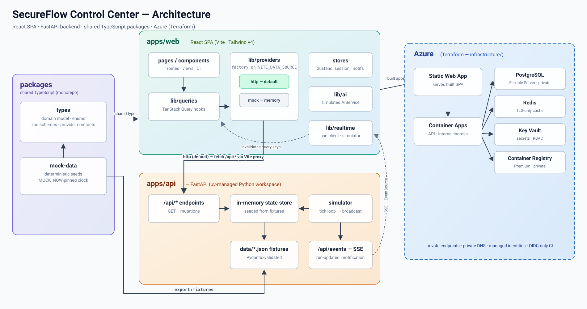

# MithrilOps

**AI-native DevSecOps control plane for secure software delivery.**

MithrilOps is a DevSecOps governance and orchestration platform that brings application teams, platform engineering, security, release management, and compliance into one workflow. It provides a single place to review delivery pipelines, security findings, infrastructure changes, deployment approvals, compliance evidence, and AI-assisted recommendations.

The project is currently a production-shaped demo/reference implementation. External systems such as GitHub, Argo CD, scanners, Azure control-plane data, and AI responses are simulated behind provider interfaces so they can be replaced with real integrations without rewriting the UI.

> **Current state:** the default HTTP mode uses a FastAPI backend with PostgreSQL persistence and server-sent events. A fully in-browser memory mode is also available for lightweight demos and tests.

## What MithrilOps demonstrates

- **Application-centric DevSecOps governance** with security posture, architecture, delivery, infrastructure, observability, and compliance views.
- **Pipeline orchestration and review** with staged execution, logs, findings, evidence, retries, approvals, and deployment-risk scoring.
- **Security command center** for vulnerabilities, secrets, IAM issues, misconfiguration, DAST findings, SLA tracking, risk acceptance, and false-positive triage.
- **Infrastructure review** for Terraform plans, drift, policy violations, cost deltas, module versions, and change risk.
- **Deployment governance** across dev, test, staging, and production with promotion, rollback, RBAC, and simulated Argo CD state.
- **Compliance evidence** mapped to OWASP, CIS, NIST CSF, ISO 27001, SOC 2, PCI DSS, and Azure Security Benchmark controls.
- **AI-assisted delivery design** that can generate architecture, staged pipelines, Terraform structure, GitHub Actions YAML, security policy, cost considerations, and implementation checklists.
- **Auditable RBAC** with eight demo roles and recorded privileged operations and denials.

## Screenshots

| Executive overview | Pipeline run |
|---|---|
|  |  |

| Security command center | AI pipeline generator |
|---|---|
|  |  |

## Architecture



At a high level:

```text
React SPA
   │
   ├── HTTP providers ───────────────┐
   ├── SSE client                   │
   └── in-browser memory providers │
                                    ▼
                               FastAPI API
                                    │
                          PostgreSQL + Alembic
                                    │
                         server-side simulator

Shared TypeScript packages provide domain types, provider contracts,
validation schemas, and deterministic demo data.

Terraform models an Azure deployment using Container Apps, PostgreSQL,
Key Vault, Storage, monitoring, managed identities, and GitHub OIDC.
```

For the detailed system design and Mermaid source, see [docs/architecture.md](docs/architecture.md).

## Technology stack

| Layer | Technologies |
|---|---|
| Web | React 18, TypeScript, Vite, Tailwind CSS v4, TanStack Query, Zustand, React Flow, Recharts |
| API | FastAPI, Pydantic, SQLAlchemy/async PostgreSQL, Alembic, SSE |
| Database | PostgreSQL 17 |
| Testing | Vitest, Pytest, Playwright |
| Monorepo | pnpm workspaces + uv Python workspace |
| Infrastructure | Terraform, Azure Container Apps, PostgreSQL Flexible Server, Key Vault, Storage, Log Analytics |
| CI/CD | GitHub Actions, GitHub OIDC, keyless Cosign signing |

## Repository structure

```text
apps/
  web/            React SPA
  api/            FastAPI backend, persistence, SSE, fixtures, tests

packages/
  types/          Shared domain models, schemas, provider contracts
  mock-data/      Deterministic seed data used by web and API fixtures

infrastructure/
  modules/        Reusable Azure Terraform modules
  environments/   dev / staging / prod compositions

docker/           Hardened container and nginx configuration
.github/           CI/CD workflows
docs/              Architecture, security, threat model, integrations,
                   deployment, local development, troubleshooting
```

## Prerequisites

- Node.js **20+**
- pnpm **9+**
- Python **3.12+**
- [uv](https://docs.astral.sh/uv/)
- Docker
- Terraform **1.9+** only if you plan to work on infrastructure

## Quick start

The default development mode uses the FastAPI backend and PostgreSQL.

```bash
pnpm install
uv sync
cp .env.example .env

docker compose up -d db

# terminal 1
pnpm dev:api

# terminal 2
pnpm dev
```

Then open:

- Web UI: `http://localhost:5173`
- API health endpoint: `http://localhost:4000/health`

Alembic migrations and demo fixture seeding run automatically when the API starts.

### Browser-only demo mode

To run the UI without FastAPI or PostgreSQL:

```bash
VITE_DATA_SOURCE=memory pnpm dev
```

This uses deterministic in-browser providers and the client-side simulator.

## Common commands

| Command | Purpose |
|---|---|
| `pnpm dev` | Start the Vite web application |
| `pnpm dev:api` | Start FastAPI on port 4000 |
| `pnpm build` | Build all workspaces |
| `pnpm lint` | Run ESLint across workspaces |
| `pnpm typecheck` | Run strict TypeScript checks |
| `pnpm test` | Run Vitest tests |
| `pnpm test:api` | Run the API Pytest suite |
| `pnpm e2e` | Run Playwright journeys in memory mode |
| `pnpm e2e:http` | Run Playwright smoke tests against FastAPI |

See [docs/local-development.md](docs/local-development.md) for database details, data modes, demo-reset behavior, and development conventions.

## Demo routes

Useful paths when reviewing the platform:

```text
/
/applications
/applications/app-payments
/pipelines
/pipelines/run-0512
/pipelines/run-1482
/security
/infrastructure
/deployments
/compliance
/generator
/audit
/settings
```

`/pipelines/run-0512` is the live simulated run and advances through stages over SSE in HTTP mode.

## Security model

Implemented controls include:

- strict TypeScript and Zod validation in the SPA;
- Pydantic validation in the API;
- centralized role-to-permission mapping for privileged UI actions;
- audit-event recording for privileged actions and denials;
- CSP and secure HTTP headers;
- non-root containers;
- GitHub OIDC instead of long-lived Azure deployment credentials;
- Terraform patterns for managed identities, Key Vault RBAC, private networking, and immutable evidence storage.

Some integrations remain deliberately simulated: GitHub actions/PR operations, scanner feeds, Argo CD state, Entra ID sign-in, and LLM-backed analysis.

A core design rule is that **AI output never bypasses a security or production approval gate**.

See [docs/security-model.md](docs/security-model.md) and [docs/threat-model.md](docs/threat-model.md) for details.

## Azure deployment model

The Terraform design targets Azure with:

- Azure Container Apps for the API and built SPA;
- Azure Database for PostgreSQL Flexible Server;
- Azure Key Vault;
- evidence storage with immutability controls;
- Log Analytics and monitoring;
- user-assigned managed identities;
- GitHub Actions federated identity through OIDC;
- optional private networking enabled for higher environments.

Example workflow:

```bash
cd infrastructure/environments/dev
terraform init
terraform plan -out=tfplan
terraform apply tfplan
```

Review [docs/deployment.md](docs/deployment.md) before applying infrastructure.

## Integration roadmap

The codebase is intentionally structured so simulated providers can be replaced incrementally. Natural next integrations include:

1. GitHub Actions and pull-request APIs for real pipeline activity.
2. Argo CD for deployment and sync state.
3. Real SAST, SCA, container, IaC, secrets, and DAST scanner feeds.
4. Entra ID authentication and server-side authorization enforcement.
5. An LLM endpoint behind the existing AI service contract.
6. Cross-replica realtime delivery using PostgreSQL `LISTEN/NOTIFY` if the API scales beyond one replica.

See [docs/integrations.md](docs/integrations.md) for the adapter boundaries.

## Known limitations

- Several external integrations use deterministic mock data rather than live systems.
- A small number of panels still read browser-side mock state even in HTTP mode.
- The server-side SSE broadcaster is process-local; a multi-replica deployment requires a shared notification mechanism such as PostgreSQL `LISTEN/NOTIFY`.
- The current authentication experience is an RBAC role switcher rather than live Entra ID sign-in.

## Documentation

Start here:

- [Architecture](docs/architecture.md)
- [Local development](docs/local-development.md)
- [Security model](docs/security-model.md)
- [Threat model](docs/threat-model.md)
- [Integrations](docs/integrations.md)
- [Deployment](docs/deployment.md)
- [Troubleshooting](docs/troubleshooting.md)

---

**MithrilOps is currently a reference/demo platform, not a production security control plane.** Its architecture is intentionally production-shaped so real providers and enforcement points can be integrated progressively.