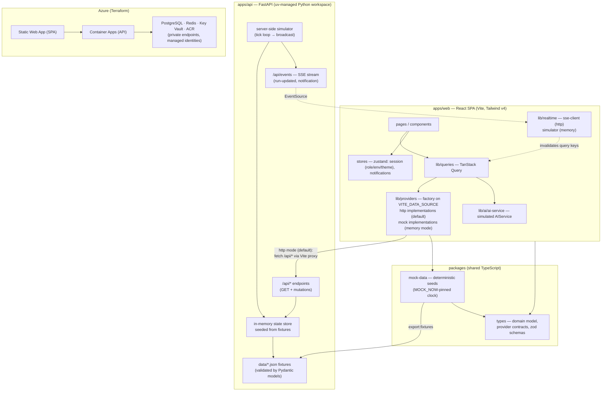

# Architecture

## System shape

## Key decisions

1. **Provider interfaces first** (`packages/types/src/providers.ts`). UI code depends only on `PipelineProvider`, `SecurityProvider`, `DeploymentProvider`, `InfrastructureProvider`, `ComplianceProvider`, `ArchitectureProvider`, `AuditProvider`, `IntegrationProvider`, and `AIService`. Mock implementations live in `apps/web/src/lib/providers`; swapping to HTTP implementations changes one module.
2. **Shared seed data** (`packages/mock-data`) keeps web and api telling the same story and makes contract tests trivial.
3. **Mutable mock state** (`mock-state.ts`) is a `structuredClone` of the seeds, so approvals, retries, promotions, and rollbacks behave statefully within a session without persistence.
4. **TanStack Query** is the single data-fetch layer; the realtime simulator invalidates query keys to push updates through the UI.
5. **RBAC in one place** (`lib/rbac.ts`): a `Role → Permission[]` matrix consumed by `useCan()` in components and displayed verbatim on the Settings page. The API scaffold documents where the same matrix must be enforced server-side.
6. **Tailwind v4 + CSS variables** for theming: semantic tokens (`--surface`, `--accent`, status colors) flip between dark (default) and light on the `html` class.

## Azure hosting (Terraform)

Static Web App (SPA) + Container Apps (API, internal ingress) + PostgreSQL Flexible Server (private, zone-redundant, Entra auth) + Redis (private, TLS-only) + Key Vault (RBAC, private endpoint, deny-by-default ACL) + ACR (Premium, private, content trust) + Log Analytics/App Insights + evidence Storage Account (WORM immutability, Entra-only data plane). All PaaS traffic rides private endpoints with private DNS zones. Identities are user-assigned managed identities; CI federates via GitHub OIDC.
