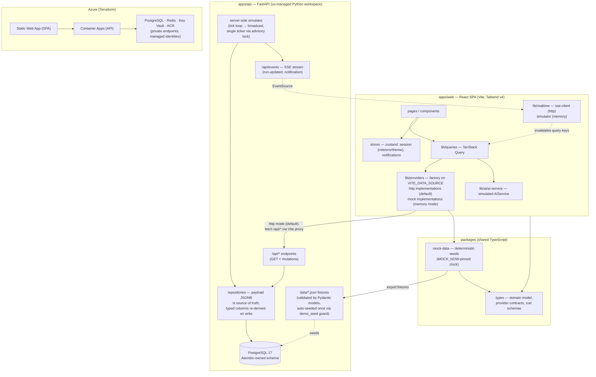

# Architecture

## System shape

## Key decisions

1. **Provider interfaces first** (`packages/types/src/providers.ts`). UI code depends only on `PipelineProvider`, `SecurityProvider`, `DeploymentProvider`, `InfrastructureProvider`, `ComplianceProvider`, `ArchitectureProvider`, `AuditProvider`, `IntegrationProvider`, and `AIService`. Mock implementations live in `apps/web/src/lib/providers`; swapping to HTTP implementations changes one module.
2. **Shared seed data** (`packages/mock-data`) keeps web and api telling the same story and makes contract tests trivial.
3. **Mutable mock state** (`mock-state.ts`) is a `structuredClone` of the seeds, so approvals, retries, promotions, and rollbacks behave statefully within a session without persistence (memory mode only — the API persists to Postgres, see below).
4. **TanStack Query** is the single data-fetch layer; the realtime simulator invalidates query keys to push updates through the UI.
5. **RBAC in one place** (`lib/rbac.ts`): a `Role → Permission[]` matrix consumed by `useCan()` in components and displayed verbatim on the Settings page. The API scaffold documents where the same matrix must be enforced server-side.
6. **Tailwind v4 + CSS variables** for theming: semantic tokens (`--surface`, `--accent`, status colors) flip between dark (default) and light on the `html` class.

## Storage (apps/api)

One table per entity, each with a hybrid schema: a `payload JSONB` column
holding the full camelCase model (identical to the wire contract and the
`data/*.json` fixtures) as the **source of truth**, plus a handful of typed
columns that exist only for `WHERE`/`ORDER BY` and are re-derived from the
payload on every write — never written independently. A `seq` identity
column preserves fixture/insertion order for list endpoints (the audit log
is the one exception, ordered `timestamp DESC, seq DESC`).

Alembic owns the schema. Migrations run at API startup, inside the FastAPI
lifespan (`asyncio.to_thread(alembic upgrade head)`), serialized by an
advisory lock in `alembic/env.py` — one code path covers local dev, the
Playwright `webServer`, and the container, rather than a separate migration
step in the entrypoint.

The database auto-seeds from the JSON fixtures on first startup, guarded by
a one-row `demo_seed` table — deliberately a presence check, not a row
count, so a demo where every run has been deleted does not silently
reseed. `POST /api/demo/reset` (gated by `DEMO_RESET_ENABLED`, 404 when off)
is the explicit way back to a known-good demo state.

The server-side simulator ticks the demo run (`run-0512`) inside a
`SELECT ... FOR UPDATE` transaction per tick — the only real write race, so
it's serialized rather than reasoned about — and derives "idle between
finished runs" from `finished_at` vs. `SIM_IDLE_SECONDS` instead of an
in-process counter, so it survives restarts and multiple replicas. Exactly
one replica ticks: the loop takes a `pg_try_advisory_lock` at startup and
sits out if it doesn't win it.

**Known limitation:** SSE broadcast is in-process, and Redis was cut from
the stack. With more than one replica, only clients connected to the
ticking replica receive live events. Dev runs a single replica. If that
changes, the fix is Postgres `LISTEN/NOTIFY`, not reintroducing Redis.

## Azure hosting (Terraform)

Static Web App (SPA) + Container Apps (API, internal ingress) + PostgreSQL Flexible Server (private, zone-redundant, Entra auth) + Redis (private, TLS-only) + Key Vault (RBAC, private endpoint, deny-by-default ACL) + ACR (Premium, private, content trust) + Log Analytics/App Insights + evidence Storage Account (WORM immutability, Entra-only data plane). All PaaS traffic rides private endpoints with private DNS zones. Identities are user-assigned managed identities; CI federates via GitHub OIDC.
